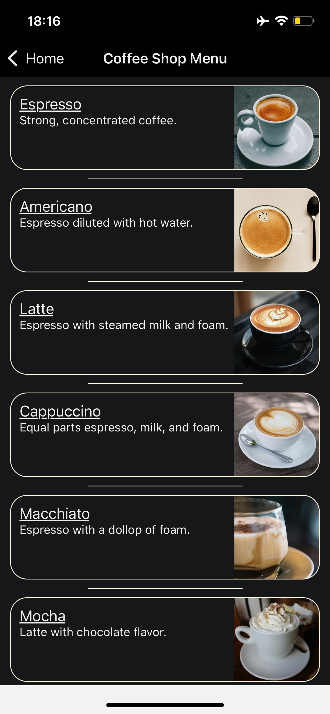
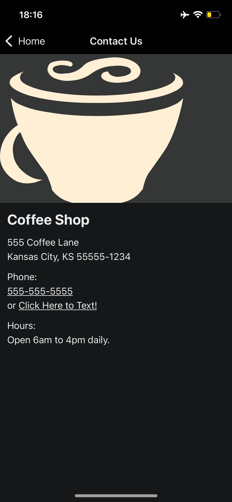

<h1 align="center"> 🍵 Coffee Shop App</h1>

## 👀Overview

This was my first static app developed for iOS and Android with Reactive Native. In this project, I created a simple aplication for a coffee shop.

## 📤Last Update

Versão 0.0.1, -> build: Coffee Shop App.

## 📸 Screenshots:





## ⚙️ Getting Started

1. Install dependencies

   ```bash
   npm install
   ```

2. Start the app

   ```bash
    npx expo start
   ```

In the output, you'll find options to open the app in a

- [development build](https://docs.expo.dev/develop/development-builds/introduction/)
- [Android emulator](https://docs.expo.dev/workflow/android-studio-emulator/)
- [iOS simulator](https://docs.expo.dev/workflow/ios-simulator/)
- [Expo Go](https://expo.dev/go), a limited sandbox for trying out app development with Expo

## ⏩ Next steps

- Make the application dynamic by consuming an API that provides new coffee options to the menu.
- Deploy;

## 📟 Contact

- For support, open an issue.
- Discovery more about [me](https://senseidanielmendes.vercel.app/).

## 🚀 Technologies

This project was developed with the following technologies:

- React Native & Expo
- Typescript
- Git e Github

## 📜 License

- This project is under a [MIT](/LICENSE) license.
